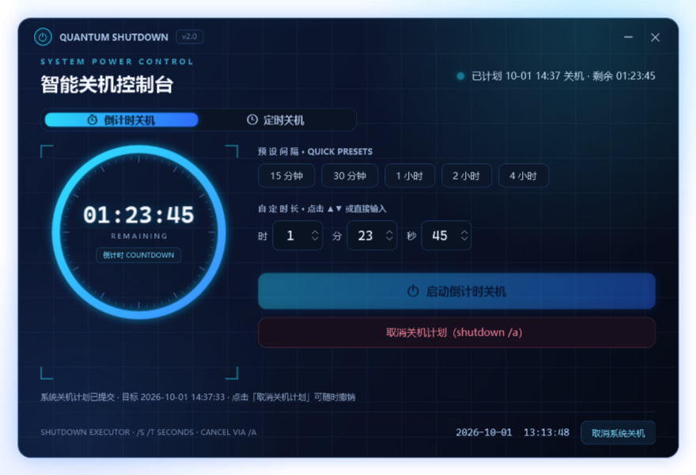

# QUANTUM SHUTDOWN · 智能关机控制台

<p align="center">
  
</p>

深色霓虹科技风的 Windows 关机计划工具。**纯 C# WPF 单文件实现，零依赖、免安装**，Windows 10 / 11 直接运行。

## ✨ 功能

- **⏱ 倒计时关机** — 时/分/秒任意组合直接键入（小时 0–999，最长约 41 天），也可用 ▲▼ 步进按钮、鼠标滚轮、键盘上下键调节（支持长按连发）；附 15 分钟 – 4 小时快捷预设
- **⏰ 定时关机** — 24 小时制 `HH:MM` 离散输入，**键入即时钳制**（超范围自动纠正，不可能设出 `36:00` 这类非法时间）；早于当前时刻自动视为次日
- **🛑 随时取消** — 一键「取消关机计划」（等效 `shutdown /a`）；计划进行中关闭程序会弹窗确认（可选拦截取消或保留计划）
- **🖥 HUD 界面** — 环形倒计时进度、状态指示灯、扫描线 / 光晕 / 网格动效

## 🚀 快速开始

### 方式一：直接使用（免安装）

从 [Releases](../../releases) 页面下载 `智能关机控制台.exe`，双击运行即可。

> 首次运行如遇 SmartScreen 蓝色拦截页：点击「更多信息」→「仍要运行」。
> （程序未购买数字签名，个人工具的正常现象；本工具不联网、不写注册表、不收集任何数据。）

### 方式二：从源码构建

```powershell
git clone https://github.com/Hu1Y1XR/quantum-shutdown.git
cd quantum-shutdown\src
powershell -NoProfile -ExecutionPolicy Bypass -File build.ps1
```

构建脚本仅调用 Windows **自带**的 `csc.exe`（`C:\Windows\Microsoft.NET\Framework64\v4.0.30319`），不需要安装 Visual Studio、.NET SDK 或任何第三方库。构建产物 `智能关机控制台.exe` 输出在 `src/` 目录。

## 🧱 工作原理

- 计划关机：调用系统命令 `shutdown.exe /s /t <秒数>`，由 Windows 在系统层执行
- 取消关机：`shutdown.exe /a`
- **刻意不使用** `/f` 强制参数：有未保存数据的程序可以阻止关机，给用户留出保存余地
- 传给 shutdown 的参数全部由界面输入钳制后的整数构成，命令注释为固定字符串，**无命令注入面**

## 🔒 隐私与安全

- 不联网、不读写用户文件、不写注册表、无开机自启、无遥测
- 运行时不需要管理员权限
- 界面数据仅保存在内存中，退出即消失
- 自测模式（可选）会在程序目录写入 `selftest_result.txt` 与渲染截图

## 🧪 自测

```powershell
.\智能关机控制台.exe --selftest   # 运行 14 项逻辑断言（输入钳制 / 回绕 / 计划计算 / 圆弧渲染）
.\智能关机控制台.exe --shots      # 自测 + 离屏渲染 4 张界面截图
```

## 📄 License

[MIT](LICENSE)
